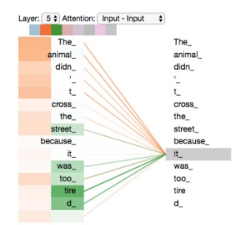
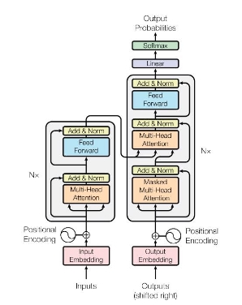
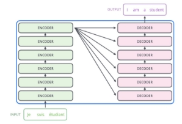
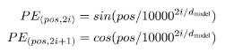
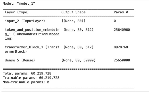
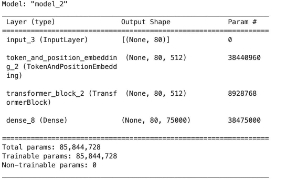
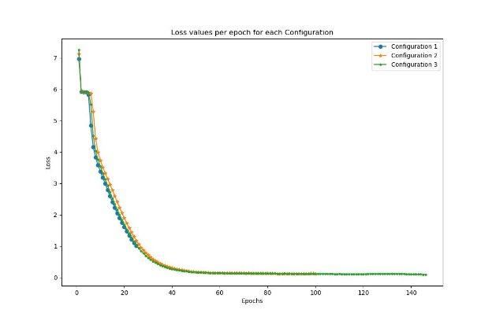

Mendes and Rai 11

Machine Learning Project 3

Text Generation Using Transformers

Ash Rai and Raniery Mendes CSC 674: Machine Learning WFU, Spring 2023

**Abstract**

This paper provides a higher-level review of the Transformer neural network architecture, with a main focus on Vaswani et al.'s seminal paper "Attention is all you need"[1] published in 2017. The Transformer has since achieved state-of-the-art performance in a wide range of language tasks. The paper is divided into two major sections. The first section introduces the model, its architecture, its key components, and the principles behind its success. The second section explores the model by implementing a text generator using a miniature transformer model, based on the linguistic style of Donald Trump. Transcripts of 35 rally speeches by the former American president during the years 2019 and 2020 have been used to train the model. The experiments performed in this work indicate that transformers are quick learners, requiring on average only thirty epochs to achieve coherent generative text (sentences). Finally, the results reveal that vocabulary size and the number of epochs are determinant factors in the performance of such a model.

“*I 'll save the washington . we have one america we did have your energy , and all over the radical left ever , just left . we have a ship , now all the senate*”. (Mini Trump-Bot)

1. **Transformer Background**
1. **Introduction**

Introduced in 2017 by Vaswani et al[1], transformers are a type of neural network architecture that has gained immense popularity in the field of natural language processing. Transformer models have since been used in a wide variety of applications such as language translation, sentiment analysis, and text summarization. Even ChatGPT, which has been the biggest technological breakthrough in recent years, is based on transformer architecture.

In natural language processing, sequence transduction is a specific type of task where input sequences are transformed into output sequences. Examples of this would include language translation, text generation, and speech recognition. Prior to transformers, sequence transduction was dominated by complex recurrent or convolutional neural networks that include an encoder and a decoder. While the performance of these models was great, the models could end up being “bloated”, and the inherent nature of these models did not allow opportunities for parallelism. Unlike traditional neural network architectures, transformers are designed to process input sequences in parallel and can handle variable-length inputs without requiring any pre-processing or padding.

2. **Architecture**
1. **Attention Mechanism**

The key innovation of transformers is the attention mechanism, which allows the network to selectively focus on different parts of the input sequence. Self-attention allows the model to look at other positions in the input sequence for clues that can help lead to a better encoding for this word[2]. More technically, it is a module that computes attention weight for each word, on how much it should attend to other words in the sequence while encoding.

 

Figure 1. An example of self attention while processing Equation 1. The above equation represents the the word “it”. Words relevant to “it” like “animal” and computation for attention. K (key), Q (query), and V “tired” have a heavier weight than other parts of the (value) are different matrices, and dk represents the sentence[2]. dimension of the model.

The transformer models take this concept of attention further by adding the “multi-headed” attention, improving the performance in two key ways. Firstly, it allows the model to focus on different token positions at the same time. It also expands the representation space, which allows for multiple sets of encoders and decoders, allowing for a more complex model.

2. **Encoder and Decoder**

Sequence transduction involve encoder-decoder structures, where the input sequence (x1, …, xn) is mapped by the encoder to a continuous representation space (z1, …, zn), which then is used by the decoder to generate the output sequence (y1, …, yn) . Vaswani et al[1] present in their paper an architecture comprising of 6 encoders stacked together, next to 6 decoders. Each layer of the encoder has 2 sublayers - a multi-head attention sub-layer, fully connected to a feed-forward network. Residual connections are also present to tackle the vanishing gradient problem, and each layer is followed by layer normalization. The decoder is almost identical in its setup to encoders, except it adds a third sub-layer. The additional masked multi-head attention sub-layer performs attention over the output.

 

Figure 2. The transformer architecture with the Figure 3. The original paper by Vaswani et al[1] presents sub-layers[2]. The left side is the encoder and the right 6 layers of encoders stacked together next to 6 layers of side is the decoder. decoders. The example above shows the translation

happening for French to English.

3. **Positional Encoding**

Transformer models do not have any recurrence or convolution mechanism to help track the order of the sequences. Hence positional encoding is used to serve this purpose. The positional encoding is injected into the input embedding at the bottoms of the encoder and decoder stacks. Rather than absolute positioning, this works based on relative positions for each token.

Equation 2. Vaswani et al[1] explore learned positional embeddings as well, but opt for a sinusoidal version since it potentially allows the model to extrapolate longer lengths.

2. **Implementation of text generator**

**2.1 Motivation**

Earlier this year, the Tech industry provided one of its most outreaching products of this decade: ChatGPT. Even though generative models are not necessarily new, OpenAI’s brand-new models (3.5 and especially 4.0) set a social and technological revolution. They introduced a new way of using the internet and technology to facilitate one’s daily tasks. For example, Microsoft announced Copilot for its Office 365 softwares as well as GitHub Copilot. Furthermore, its extremely easy user experience and interface have allowed this new technology field to achieve groundbreaking impacts. Associated with this new technological revolution, we have powerful transformer models working behind the scenes. As computer scientists, we could not resist but explore and learn more about this ML technology.

2. **Goal**

This project aims to implement a mini-Trump text generator[^1]. In other words, we implement

a transformer model that learns from speeches given by former American president Donald Trump (input) and produces coherent sentences that replicate his linguistic/wording behavior. Thus, we propose an implementation of a basic transformer model that takes excerpts of the speeches, as inputs, and is capable of generating sentences mimicking Trump’s linguistic nuances.

3. **Dataset and Preprocessing**

In order to achieve the goal mentioned in the previous section, we leveraged an open-source repository - available on [Kaggle](https://www.kaggle.com/datasets/christianlillelund/donald-trumps-rallies?resource=download) - that contains speeches delivered by the former American president during the years of 2019 and 2020 (presidential race). The dataset contains the full-speech Trump gave at thirty-five different rallies across the United States, ranging from Dallas up to New Hampshire. Each speech has its own file, provided in .txt format, and consists of the complete transcription. However, it is important to note that such transcripts do not include linguistic field pauses.

When it comes to the data preprocessing phase, given that the raw data was already sufficiently cleaned, our primary work consisted of combining the thirty-five files into a single one. We opted for doing this due to the fact that it makes the training phase more efficient, as we are capable of increasing the number of input paragraphs we can feed to the transformer. In that sense, after the concatenation of all speeches, we grouped the sentences in paragraphs of size equal to ten sentences. The reasoning behind this is that even though the average size of a paragraph is five sentences, in rally settings, speakers tend to shorter sentences to maintain supporters’ attention as well as to be persuasive. So, we assume ten sentences is the proper optimal length to capture the speaker’s “thought”. For our implementation, a sentence is considered to be any sequence of words delimited by a period. Below is an example of a sentence followed by an example of what a paragraph is.

**Sentence**: “*Thank you and Vice President Mike Pence, thank you very much*.”

**Paragraph**: "*Thank you everybody. Thank you and Vice President Mike Pence, thank you very much. Incredible. And, hello to Fayetteville. Hello, Fayetteville. It's great to be here in North Carolina's ninth congressional district with the hardworking patriots who believe in faith, family, God and country. Thank you. Thank you. Tomorrow you'll head to the polls to elect a congressman who always puts America first, Dan Bishop. I've just come from a meeting with North Carolina officials representing communities hit by Hurricane Dorian and I expressed the unwavering solidarity of the American people, we are behind you 100%.*"

This data manipulation also translated into a larger vocabulary space that we could use to train our model. We believe this allowed us to obtain a more powerful transformer than if we had trained the model gradually on each speech. Therefore, our training dataset consisted of 3378 speech paragraphs, totalizing 33780 sentences.

4. **Model Architecture**

The theoretical aspects of the architecture of our transformer model resemble the one presented in Section 1. Thus, in this part of the paper, our focus is on describing the technical details of the architecture of the model we implemented.

Our mini-Trump text generator was implemented using the TensorFlow and Keras packages in a JupyterLab environment, following an implementation tutorial available at the Keras platform in the Generative Deep Learning section[2]. Similarly to the paper, the transformer (autoencoder) consists of two macro layers: encoder and decoder. Both of them consist of a stack of one encoder/decoder layers, which ultimately consist each of two sublayers: a multi-head self-attention mechanism and a feed-forward network Each encoder and decoder’s output is normalized, however, in the decoder, each of the two sublayers is also followed by a third sublayer, which is responsible for performing multi-head attention over the output of the encoder stack. The transformer leverages the (Keras) sparse categorical cross entropy function to compute the loss of the model during training. Regarding optimization, our transformer uses the Adam optimizer. However, we emphasize that neither the loss nor the optimization occurs with respect to the word embedding that is used by the transformer. In fact, those are done based on the transformer’s self-attention and feed-forward mechanisms, that is, we compute the loss and perform optimization with respect to the autoencoder.

Using the architecture above, we ran experiments under three configurations in this project. The first configuration represents a baseline transformer, whereas the second one illustrates a more optimized one, which replicates both dimensionality and the number of attention-head nodes from the paper published in 2017.

1) The first one presents both word embedding and feed-forward network dimensionality equal to 256. It uses two attention-head nodes as well as it has a vocabulary size of 50,000 words.
1) The second configuration presents both word embedding and feed-forward network dimensionality equal to 512. It uses eight attention-head nodes as well as it has a vocabulary size of 75,000 words.
1) The third configuration presents both word embedding and feed-forward network dimensionality equal to 512. It uses eight attention-head nodes as well as it has a vocabulary size of 100,000 words.

In the figures below, we portray the number of parameters our transformer model is able to train for the first and second configurations. The third one is not displayed as it is currently in training.

 

Figure 4. Transformer trainable parameters for Figure 5. Transformer trainable parameters for configuration 1 configuration 2

5. **Results and Discussion**

In politics, a core aspect of the success of a candidate and/or political actor relies on how they speak to their electorate. Multiple scholars investigate, through content analysis, the impact that different forms of speeches have on individuals. It occurs because the current scholarship claims that politicians, while they are in office, share a common major goal: reelection; and to do that they resort to three methods - position taking, advertising, and credit claiming (Mayhew, 246-251). Even though they all depend on the actor’s speech, each presents itself in a different way according to the setting in which the speech is given. Our, mini-Trump chat is capable of capturing all those nuances and implementing them in the generated text thanks to our preprocessing step. By combining the thirty-five files into a single file and grouping them into paragraphs, we end up having paragraphs that embrace more than one characteristic among credit claiming, advertising, and position taking.

The training of the model took place in an Apple machine with a (standard version) M2 processor chip and 16GB of memory. We believe the fact that the M2 has an SoC architecture and leverages an integrated GPU optimization - for Machine Learning tasks - contributes significantly to the training efficient runtime we experienced. Indeed, it offered us the opportunity to train our model with different numbers of epochs.

Before diving into a larger discussion of our results, it is important to stress that the three configurations were trained using the same input sentence: “Thank you for coming to my grand rally!”. Our first configuration was trained for twenty-five epochs, taking about one hour for the entire execution. As previously illustrated, it was able to train almost 60 million parameters in total. The second configuration was trained for one hundred epochs, taking about four hours for execution. It trained more than 85.5 million parameters in total. When it comes to the third configuration, which was trained for two hundred epochs, we cannot offer final results, just preliminary ones. It occurs because it has not finished its training yet. It has been running for more than 40 hours, with an average of 34 minutes per epoch.

This work’s most basic transformer model presented interesting results, even though it was trained for only one-fourth of the second configuration’s amount of epochs. It was able to decrease its loss by more than 85%, going from 6.9688 to 1.0009 in its 25th epoch. Below we exemplify how a transformer is a powerful and quick learner. In the sentence I, we have the group of sentences generated in the third epoch, while sentence II and III display the group of sentences output in its twenty-third and twenty-fourth epoch. This definitely shows how our transformer model was able to move into a generation of more coherent sentences, however, it is still not close to perfect, particularly the last sentence it produces. We believe this may be due to the fact that the self-attention mechanism was not able to properly assign the attention score of some words.

Sentence I: “*. . . to the , , a , . the it and , . 's the and to a it , to it 's the , i the it 's we and . a , . i , , a the . and . and the . i and it and , , the . the , i the . the to , 's we and , to and it . the , the the a . it , . . , a . . it i , i , the a we a , to , and . to”*

Sentence II: “*now the whole country to the great state senate president has no party , who can 't get over there is fear of the history of the state of the senate majority leader , that the state of north carolina . and failing government school yards , right ? right ? i don 't have a guy running for nothing right ? it will defend its own chief of staff illegal birth rebuilding staff illegal illegal illegal work staff work illegal staff illegal illegal it illegal illegal rebuilding staff illegal illegal work illegal illegal illegal staff work staff*”

Setence III: *“i can 't get to the greatest economy is through the history of the first speeches and i 'd do is more to give it ? but i do that to do ? i 'd do that to give them a lot more money for more money , right ? more to give an important . but i 'd love more , that because four more . i went to , , to , , to , to and , to to , , to in , , , , , , to , to , , ,”*

Our second configuration presents more compelling results and performance. During training, the transformer decreased its loss from 7.1306 to 0.1270, which represents a decay of more than 98%. Further, the paragraphs it generated are more coherent than the ones obtained using our first model configuration. This is displayed in sentences IV, V, and VI. On the other hand, we acknowledge that those results are not near perfect, as they still present some grammatical errors as well as disconnection between different sentences. Thus, even though the texts do incorporate and mimic the linguistic style present in Donald Trump’s speech, one can easily identify that those were produced by a machine and not a human being.

Sentence IV: “*first lady ? i said , who 's got more about michigan tonight . " and the virus . i said , could do , "it should we get the most prosperous economy and the good time came in the world , right , and we had a protest ? let them , how does , you 've lifted 10 million people off of food stamps . and they 're getting very good good good good good good much good good good good good good good good good good good good good good good good good good good good good good”*

Sentence V: “*first i do today in a new hampshire ? i said , right ? i like new hampshire ? i said , i said republican party can 't give free rolls royce . but i got this , i could secure these trade deals that we 're all right now we 're going to be honest with you can 't talk about that every category , that we 've ever had . " " " " " " " " " and " " " " " " " " " " " " " " " " " " "”*

Sentence VI: *“next first i think that . i don 't think so first lady . " that 's sleepy joe biden " , i said free thought was going to what happened , i said that ? no , who apologized for america . he have a president obama said , "no , i just say , does kentucky . i 'm sorry , it 's a president . i 'm president xi of of of of of of of of of of of of of of of of of of of of of of of of of of of of of”*

Regarding this work’s third and most powerful configuration, we are only able to offer preliminary results. It occurs because, with the increase in the number of epochs and the vocabulary size, the training run time has increased dramatically. While the first two configurations took a couple of hours, this last one is expected to take more than 50 hours, based on our current time tracking. However, we include below two interesting, coherent sentences that we obtained in its 112th and 125th epochs.

Sentence VII: “ "*oh come here . " and then i bring back to see and i was a guy , right ? could … that 's so many times 50 guy standing up . at the bloodthirsty savage known as al baghdadi . and he was quickly period of quickly replaced by his second -in -command and his second -in -command is now dead . and we 've got our eye on and and and and and and and and and and and and and and and and and and and and and and and and and and and and and*”

Sentence VIII: “ "*oh a guy that 's i see . " and now you draw a crowd . so texas . i a crowd . i put it a big crowd . so is a big crowd . i was very hot . just a little bit too . i put there are very strong on up here today* *. no , that 's one , great state of colorado . we have 're 're have 're 're 're 're 're 're have 're 're 're have brought 're 're have 're 're 're 're 're have 're 're have 're*”

Finally, as we previously mentioned, our transformer models were quick learners. That can be well captured by plotting how their loss curve behaved over the number of epochs executed. This shows how transformers decrease their loss at a very fast pace. In our three experiments, the models take about 28 epochs to achieve a loss equal to or smaller than 1.

Figure 6. Comparison of transformer’s loss behavior per epoch using the three configurations in section 2.4.

With all that being said, our project demonstrated how transformers are a very powerful machine learning tool, which still has a lot to be explored both by academia and the industrial sector. Even though our results (output paragraphs) are not perfect, they do illustrate how this is a state-of-the-art model, when it comes to generative models. We expect that an increase in the training data as well as in the vocabulary size may yield more impressive results.

In terms of future work, we would like to focus on two directions. Building on our current work, we aim to investigate how to better identify and classify specific speech behavior so that transformers can learn faster and generate more coherent sentences. On a more sociological level, as models like our mini Trump text generator become more common, new ethical issues will tend to arise. So, it is critical that future work explores new methods to improve the detection of AI-generated sentences.

References

1. Vaswani, Ashish, et al. "Attention is all you need." Advances in neural information processing systems 30 (2017).
1. Alammar, Jay. “The Illustrated Transformer.” The Illustrated Transformer – Jay Alammar – Visualizing Machine Learning One Concept at a Time., https://jalammar.github.io/illustrated-transformer/.
1. Nandan, Apoorv. “Keras Documentation: Text Generation with a Miniature GPT.” *Keras*, https://keras.io/examples/generative/text\_generation\_with\_miniature\_gpt/.
1. Lillelund, Christian. “Donald Trump Rally Speeches.” *Kaggle*, 26 Sept. 2020, https://www.kaggle.com/datasets/christianlillelund/donald-trumps-rallies.
1. Mayhew, David R. *Congress: The Electoral Connection*. Second edition, Yale University Press,

   2004\.

[^1]: In this paper, we also refer to it as mini Trump chat.